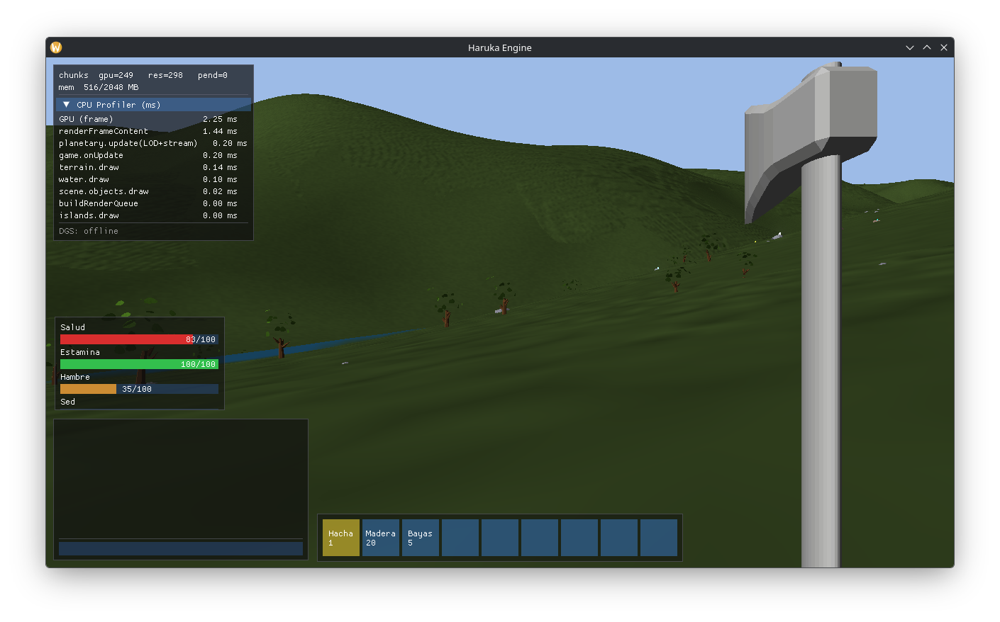

# HarukaEngine (v1.0)

**C++17 / OpenGL 4.6** real-time 3D engine for space exploration, planetary terrain generation, and game development.

Distributed as a shared library (`libHarukaEngine.so`) with integrated asset pipeline, physics engine, and procedural world generation.



## ✨ What makes Haruka unique

Most engines render a *level*. Haruka renders a **solar system at true scale** and lets you walk on it — the same code path takes you from orbiting a star to a pebble at your feet, with no loading screens and no fake skybox.

- **🪐 Real-scale planets, millimetre precision.** Earth sits ~1 AU (1.5×10⁸ m) from the sun at its real radius (6 371 km). Rendering is **camera-relative double precision**: the world is re-centred on the camera every frame so GPU floats never lose precision, no matter how far from the origin you are. You can fly from interplanetary space down to the grass without a seam.

- **⚡ GPU-compute terrain, streamed grueso→fino.** The planetary heightfield (continents, ridged mountains, lakes) is generated on the **GPU via compute shaders** (Perlin ported 1:1 from the CPU sampler, parity-validated) and harvested **asynchronously with GL fences** — the CPU never blocks on the GPU. A cube-sphere **quadtree LOD** streams chunks **progressively coarse→fine**: a node only subdivides once its parent is resident, so you **never see a black hole** while detail loads — the planet fills in from low-poly to crisp. An optional **LOD floor** keeps the *entire* planet resident at a base detail so the far side is always there.

- **🌗 Movable celestial bodies.** Planets and moons **orbit** (day/night from the sun, moonlight, sun–moon tides). Terrain chunks are stored **planet-local**, so a body can move every frame **without regenerating a single chunk** — the renderer just re-anchors them. Moons, gas giants and home worlds are **the same kind of procedural, streamed body**, declared entirely in the **scene file** (a `terran` / `moon` / `gas` generation profile), not in game code.

- **🌊 Hybrid water & living sky.** Oceans (Gerstner waves), inland rivers/lakes and PBF fluid particles share one water system. A **procedural atmosphere** (gradient sky + sun disc + stars that emerge at night and in space, fading to black with altitude) replaces any cubemap. Wind, tides and a cratered moon are all driven by the same celestial mechanics.

- **🛠️ Deformable, editable worlds.** A deformation field lets you **dig, build and flatten** the procedural surface (sphere or oriented-box footprint), with the affected chunks re-streamed live — terrain that's both generated *and* author/player-editable.

- **🔊 One solver, two senses.** The **propagation** system finds the path A→B **around walls and through openings** (placed colliders + terrain occlusion). It's shared by **audio** (sound bends around corners; AI literally "hears" the player for stealth) **and** by **curving projectiles** (serpentine spells follow the same route).

- **🧩 Modular by bitmask.** Fluids, soft-body, networking, audio, particles, terrain, post-FX, shadows and physics are **compile-time modules** — strip what you don't need to a lean binary; the game is built with the same mask.

> In short: a **source-available, single-`.so` engine purpose-built for seamless planetary-scale worlds** — double-precision origin, GPU-streamed procedural terrain, orbiting editable planets, and a propagation model that unifies stealth audio and curving spells.

---

## 🎯 Core Features

### 🖼️ Rendering
- **Deferred Shading Pipeline** — G-Buffer + light accumulation for hundreds of dynamic lights
- **PBR Materials** — Metallic/Roughness workflow with IBL (Image-Based Lighting)
- **Advanced Shadows** — Cascaded shadow maps + point lights + directional shadows
- **Post-Processing** — SSAO (Screen Space Ambient Occlusion), HDR + bloom, tone mapping
- **GPU Compute** — Frustum culling, compute post-processing via SPIR-V shaders

### 🌍 Procedural Worlds
- **Double-Precision Coordinates** — Millimeter precision at astronomical scales (camera-relative; tested to AU distances)
- **Procedural Planetary Terrain** — Cube-sphere projection, Perlin/fBm continents + ridged mountains + lakes, generated on the **GPU (compute shaders)**
- **Cube-sphere Quadtree LOD** — Deep, distance-driven detail (root face → fine leaves) with **progressive coarse→fine streaming** and an optional whole-planet LOD floor
- **Async Chunk Generation** — GPU dispatch harvested via **GL fences** + mesh assembly on worker threads (never blocks the frame), LRU RAM cache
- **Floating Origin** — Per-frame world re-centering on the camera to keep GPU float precision

### ⚙️ Physics & Simulation
- **Rigid Body Dynamics** — Gravity, collisions, friction
- **Planetary Gravity** — N-body gravitational forces + character ground detection
- **Broad-Phase Octree** — Efficient collision detection via spatial partitioning
- **Terrain Raycast** — Ground detection for procedural planet surfaces

### 🎮 Game Systems
- **3D Audio** — OpenAL listener (camera) + **world sound sources** (persistent positional emitters) + one-shot SFX. Device selection in-settings (input/output, SDL3).
- **Propagation / nav** (`core/propagation.*`) — finds the path A→B **around walls** (placed OBB colliders) and through openings + **terrain occlusion**; `through()` returns a 0..1 throughput (playback **and** logical: AI "hears" the player → stealth), `path()` returns the waypoints. **Shared** by audio (sound routes around walls) and by **curving spells** (serpenteante projectiles follow the same path).
- **Voice input (optional)** — Mic capture (SDL3) + **Vosk** offline speech-to-text with a restricted grammar; used by the game for voice-cast abilities. Compiles without Vosk (stub).
- **i18n / Locale** — `assets/lang/<code>.json` key→string, `TR("key")` resolution, base-language fallback. Languages auto-detected; modular per-language assets (`assets/voice/<code>`, `assets/audio/<code>`).
- **Terrain editing** — Deformation field (dig / build / **flatten/level**, sphere or oriented-box footprint) over procedural terrain, with chunk re-streaming.
- **Particles** — GL_POINTS additive radiant system (trails, impacts).
- **Settings** — Persisted graphics/audio/controls/language; rebindable input actions; in-game panel (tabs).
- **Component Architecture** — Scripts, materials, meshes attached to entities

---

## 🔧 Dependencies

Haruka needs three groups of dependencies. **Two of them you already have** the moment you
clone the repo — only the system libraries and SDL3 require a download.

### 1. Vendored — *already in the repo* (nothing to download)

These ship **committed** inside the source tree (they are **not** git submodules, so a plain
`git clone` is enough — no `git submodule update`):

| Path | Library | Role |
|------|---------|------|
| `third_party/glad`            | GLAD            | OpenGL 4.6 function loader |
| `third_party/imgui`           | Dear ImGui      | editor / debug UI |
| `third_party/json`            | nlohmann/json   | scene & save serialization |
| `third_party/stb`             | stb_image       | image loading |
| `third_party/nativefiledialog`| nativefiledialog| file dialogs |
| `external/dgs`                | DGS client      | optional networking (`HARUKA_NETWORK`) |

> ✔️ No action required — CMake picks these up from the tree.

### 2. System libraries — one install command

These come from your distro's package manager.

```bash
# Fedora
sudo dnf install cmake gcc-c++ pkgconf-pkg-config \
    glm-devel glslang \
    assimp-devel openal-soft-devel libzstd-devel \
    openssl-devel postgresql-devel gtk3-devel
```

```bash
# Debian / Ubuntu (equivalents)
sudo apt install cmake g++ pkg-config \
    libglm-dev glslang-tools \
    libassimp-dev libopenal-dev libzstd-dev \
    libssl-dev libpq-dev libgtk-3-dev
```

*Optional:* `vosk-api` for offline voice input — without it the voice module compiles as a
stub, so you can skip it.

### 3. SDL3 — download & build manually

SDL3 isn't in most distro repos yet. Pick one option:

```bash
# Option A: Vendorize (recommended)
git clone https://github.com/libsdl-org/SDL third_party/SDL
cd third_party/SDL && git checkout SDL3 && cd ../..

# Option B: Compile and install system-wide
git clone https://github.com/libsdl-org/SDL third_party/SDL
cmake -B third_party/SDL/build -S third_party/SDL -DCMAKE_BUILD_TYPE=Release
cmake --build third_party/SDL/build -j$(nproc)
sudo cmake --install third_party/SDL/build
```

### System-library reference

| Package (Fedora) | Role |
|---------|------|
| **cmake** | Build system |
| **gcc-c++** | C++17 compiler |
| **pkgconf-pkg-config** | Library discovery |
| **sdl3** | Window/context/input (**compile manually**, see above) |
| **glm-devel** | Vector math (vec3, mat4, **dvec3 for astronomical precision**) |
| **glslang** | GLSL → SPIR-V shader compilation (build-time; `glslc` also works) |
| **assimp-devel** | 3D model loading (OBJ, FBX, GLTF) |
| **openal-soft-devel** | 3D positional audio |
| **libzstd-devel** | Save / asset compression codec |
| **postgresql-devel** | Player/world persistence |
| **openssl-devel** | WebSocket TLS |
| **gtk3-devel** | File dialogs |
| **vosk-api-devel** | *(optional)* offline speech-to-text for voice input — without it the voice module compiles as a stub |

> The vendored libraries (`glad`, `imgui`, `nlohmann/json`, `stb`, `nativefiledialog`, `dgs`)
> are listed in **§1 above** and need no install.

---

## 🔨 Build

### Quick Start

```bash                     # VERSION defaults to 1.0
cmake -B build -DVERSION=XX.XX.XX  -DHARUKA_NETWORK=ON/OFF # explicit version
cmake --build build -j$(nproc)
```

### Output

```
build/
└── 6/
    ├── bin/
    │   ├── libHarukaEngine.so          ← Shared library
    │   └── shaders/
    │       ├── pbr.spv                 ← Compiled shaders
    │       ├── terrain.spv
    │       ├── shadow.spv
    │       └── ...
    └── include/
        └── Haruka/                     ← Public headers
```

### Modules (build-time)

The engine is split into optional modules toggled by a bitmask. CMake generates
`src/core/modules.h` (`#define HARUKA_MOD_<NAME> 1`) and excludes the sources of
disabled modules. Order of the bitmask = the list below.

| Bit | Module | Purpose |
|-----|--------|---------|
| 0 | `FLUIDS` | ocean + shallow-water + PBF particles (hybrid water) |
| 1 | `DEFORM` | terrain deformation field (dig / build / flatten) |
| 2 | `SOFTBODY` | XPBD cloth / jelly / wind |
| 3 | `NETWORK` | DGS network client |
| 4 | `AUDIO` | 3D audio: `audio_manager` (API + listener + world sources + propagation) → `audio_loader` (buffers) + `audio_system` (OpenAL backend) |
| 5 | `PARTICLES` | particle system |
| 6 | `TERRAIN` | planetary terrain (default-ON; off = no planet) |
| 7 | `POSTFX` | bloom / SSAO / HDR / IBL |
| 8 | `SHADOWS` | shadow maps |
| 9 | `PHYSICS` | rigid-body physics + colliders (default-ON) |

```bash
# All modules ON (default)
cmake -B build -DVERSION=1.0

# Custom mask (1 char per module, in list order): e.g. fluids+deform off
cmake -B build -DVERSION=1.0 -DMODULES=0011111111
```

> ⚠️ Configuring with `-DMODULES=...` rewrites `src/core/modules.h` in the source
> tree (via `configure_file`). The game (`Survival`) must be built with the **same**
> mask — its `build.sh` keeps engine + game in sync from one place.

### Shaders (engine vs game)

Engine shaders live in `haruka-cpp/shaders/` and are compiled to `.spv` (+ GLSL copy) at
build time. **Game-specific shaders live in the game repo** (e.g. `Survival/shaders/`) and are
compiled by the game's build into the same runtime `shaders/` dir, coexisting by name. Each
shader is compiled **once** by its owner — the game copies (does not recompile) the engine's
shaders. So adding a game shader never touches the engine.

---

## 📖 Documentation

Comprehensive architecture and implementation guides are included:

| Document | Content |
|----------|---------|
| [ANALISIS_SISTEMAS.md](docs/guides/ANALISIS_SISTEMAS.md) | Deep dive into ObjectType, SceneManager, WorldSystem, PlanetarySystem |
| [DIAGRAMAS_FLUJO.md](docs/guides/DIAGRAMAS_FLUJO.md) | Data flow diagrams, memory strategies, performance profiling |
| [PATRONES_USO.md](docs/guides/PATRONES_USO.md) | Code examples, floating origin, chunk generation, LOD system |
| [GUIA_RAPIDA.md](docs/guides/GUIA_RAPIDA.md) | Quick reference, debugging tips, configuration templates |
| [Doxygen API Docs](docs/html/index.html) | Autogenerated reference (run `doxygen Doxyfile`) |

### Generate API Documentation

Documentation generated by Doxygen.

---

## 🏗️ Architecture Highlights

Chunks are **generated asynchronously** using multi-octave Perlin noise and cached in RAM (LRU eviction when >256 MB).

### Scene JSON Format

```json
{
  "objects": [
    {
      "name": "Earth",
      "type": "planet",
      "position": [0.0, 0.0, 0.0],
      "hasChunks": true,
      "terrainSettings": {
        "seed": 42,
        "minHeight": -200.0,
        "maxHeight": 1200.0,
        "layers": [...]
      },
      "lodSettings": {
        "distances": [100.0, 500.0, 2000.0, 10000.0]
      },
      "streamingSettings": {
        "mode": "procedural",
        "cacheSizeMB": 256
      }
    }
  ]
}
```

---

## 📝 Status & Roadmap

**Current Version:** 1.0 — Deferred renderer, terrain streaming, physics foundation

---

## 📄 License

**Haruka Source-Available License v1.0** — © 2026 Andoni García Torres. See [LICENSE](LICENSE.md).

Free to view, study, modify, and use for **non-commercial** purposes; **commercial use needs
written permission**. Any improvement built using the engine is **licensed back** to the author
(grant-back). Third-party components (DGS, Dear ImGui, GLAD, GLM, SDL3, OpenAL, …) keep their
own licenses.

---

## 🔗 Related Projects

- **haruka** — ImGui-based editor built on top of HarukaEngine

---

**Last Updated:** 19 May 2026 | **OpenGL 4.6** | **C++17/20**

